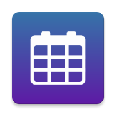

# Time Table Flutter

An app for displaying school time table.

## Steps to compile

1. Clone this Repository

2. Setup Firebase using [this](https://firebase.google.com/docs/flutter/setup?platform=android) tutorial

3. Create a new Cloud Firestore Database using the Firebase console

4. Create a new collection named ```time-table```

5. Create new documents for each day inside the collection starting with a capital letter (case-sensitive). Eg: ```Monday```

6. Add 5 string parameters to each document, ```subject1```, ```subject2```, ```subject3```, ```subject4```, ```attendance```. The last one being the link of the attendance (set it to ```about:blank``` if you don't want it). If you don't have any classes on a particular day, leave them empty.

TODO: add dynamic subject numbers option

The final Firebase database should look like this - 


7. Update ```sdk.dir``` and ```flutter.sdk``` in ```android/local.properties``` to your android sdk directory and flutter sdk directory respectively

8. Build app using [this](https://flutter.dev/docs/deployment/android) tutorial
